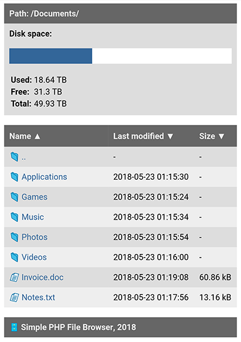

# About
**Simple PHP File Browser** is a tiny web application that helps you to browse your files uploaded on your web server.

## Features
- Very small code size (less than 9 kB)
- Sort folders and files by name, date of last modification and size (ascending / descending)
- Disk usage
- Responsive mobile design
- Ability to create your own HTML and CSS templates

## Installation
1. Download source codes from GitHub
2. Edit "settings.php" file in "src" folder and set the following:
- $basedir - your base directory where your files will be stored (default: "./files")
- $allow_parent - allow (true) or deny (false) users to use 2 dots (..) in URL to access parent directory (default: "false")
- $template - the name of your HTML template folder located in "templates" folder (default: "default")
- $diskinfo - show (true) or hide (false) disk usage info in page header (default: "true")
3. Copy the content of "src" folder to your web server
4. Open your web server address in your web broswer

## Screenshot

 

## License
This software is developed as open source under [MIT License](./LICENSE).
